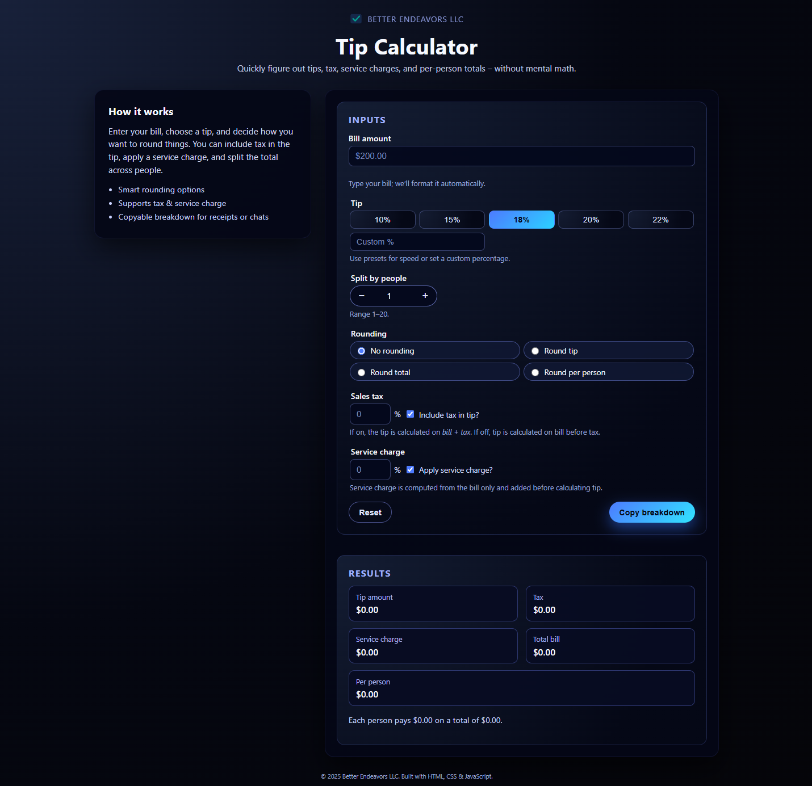

# Tip Calculator

A production-style, fully responsive tip calculator built with **HTML, CSS, and vanilla JavaScript**.  
Designed to handle real-world restaurant scenarios including tax, service charges, rounding strategies, and per-person bill splitting.

## 🔗 Live Demo
https://sharpsanders.github.io/tip-calculator/



---

## 🚀 Key Features

### Bill & Tip Input
- Auto-formatted bill input
- Preset tip buttons (10%, 15%, 18%, 20%, 22%)
- Custom tip percentage support
- Accurate calculations with configurable rounding

### Splitting & Rounding Logic
- Split totals between **1–20 people**
- Multiple rounding strategies:
  - No rounding
  - Round tip
  - Round total
  - Round per person

### Tax & Service Controls
- Optional sales tax %
- Toggle to include tax in tip calculation
- Optional service charge % (applied before tip)

### Live Breakdown Output
- Tip amount
- Tax amount
- Service charge
- Total bill
- Per-person total
- Auto-updating summary panel

### UX Enhancements
- Copy-to-clipboard breakdown summary
- Visual confirmation feedback
- Mobile-first responsive design
- Accessible, keyboard-friendly inputs

---

## 🧠 Technical Highlights

- Structured separation between calculation logic and DOM updates
- Reusable helper functions for monetary formatting
- Guard clauses for defensive input validation
- Controlled rounding to prevent floating-point drift
- Clipboard API integration for improved UX

---

## 🛠 Tech Stack

- HTML5 (semantic structure)
- CSS3 (custom dark UI, responsive layout)
- JavaScript (ES6+)
- No frameworks — lightweight and dependency-free

---

## 📂 Project Structure

```txt
tip-calculator/
  index.html
  style.css
  script.js
  img/
    Screenshot-tip-calculator.png
  favicon.ico
  favicon.svg
  logo.svg
▶ Run Locally
Clone the repository

Open index.html in your browser

No build tools or dependencies required.

👤 Author
Built by Trevyn Sanders
Better Endeavors LLC